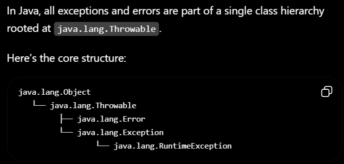
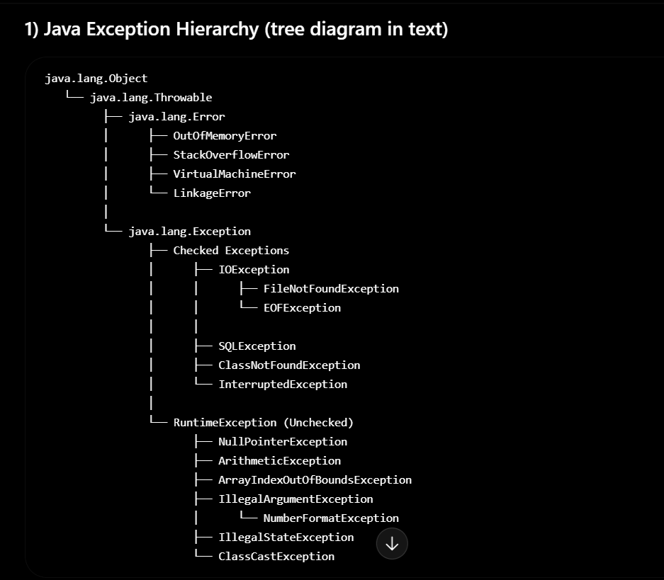

| Convention Type | Rule + Example                                                                                                                               | Why the bad name fails                                                                                                                     |
| --------------- | -------------------------------------------------------------------------------------------------------------------------------------------- | ------------------------------------------------------------------------------------------------------------------------------------------ |
| Variable        | **Rule:** Use meaningful, camelCase names that describe the stored value.<br>**Bad:** `x`<br>**Good:** `studentCount`                        | `x` gives no clue about what the variable stores, making the code harder to understand and maintain.                                       |
| Method          | **Rule:** Use a verb or verb phrase in camelCase that describes the action performed.<br>**Bad:** `data()`<br>**Good:** `calculateTotal()`   | `data()` is vague and does not indicate what the method actually does.                                                                     |
| Class           | **Rule:** Use PascalCase with a descriptive noun representing the object or concept.<br>**Bad:** `student_info`<br>**Good:** `StudentRecord` | `student_info` uses underscores instead of PascalCase and does not follow standard class naming conventions.                               |
| Constant        | **Rule:** Use UPPER_SNAKE_CASE for values that never change.<br>**Bad:** `maxSize`<br>**Good:** `MAX_SIZE`                                   | `maxSize` looks like a regular variable, so readers may not recognize it as an immutable constant.                                         |
| Boolean Method  | **Rule:** Start with `is`, `has`, `can`, or `should` to indicate a true/false result.<br>**Bad:** `active()`<br>**Good:** `isActive()`       | `active()` does not clearly communicate that the method returns a boolean value, while `isActive()` makes its purpose immediately obvious. |


## Research Prompt 1.2 — The Cost of Misleading Names
- Misleading or vague names do more than make code look untidy—they increase the chance of incorrect behavior and make every future change more expensive
- Misleading names are dangerous because developers depend on them to build a mental model of a program before they fully inspect its implementation. Since working memory is limited, programmers cannot keep every detail of a large codebase in mind. Instead, they use identifiers such as class, method, and variable names as cues for predicting behavior. When a name accurately reflects what the code does, these predictions are usually correct. However, a misleading name creates an incorrect mental model. Developers may skip reading the implementation because the name appears trustworthy, leading them to use the code in ways its author never intended. This can introduce subtle bugs that are difficult to detect, especially in large systems where methods are reused frequently.

For example, consider a Java method named `getUser()`:

```java
public User getUser(long id) {
    auditLog.saveAccess(id);   // Hidden side effect
    return repository.findById(id);
}
```

A developer would reasonably expect `getUser()` to simply retrieve a user. If they call it repeatedly while validating input or rendering a preview, they may unknowingly generate thousands of audit log entries or trigger unnecessary database writes. The misleading name therefore causes more than confusion—it encourages incorrect assumptions that directly lead to faulty program behavior.

## 1.3 — Self-Documenting Code vs. Comment Dependency
- Self-documenting code is code that is written so clearly and expressively that its purpose and behavior are easy to understand without relying heavily on comments. It uses meaningful names, simple structure, and clear logic to communicate intent.
- What types of comments does Clean Code say are valuable — and what types does it say are harmful?

| Comment Type           | Example (Java)                                                                                                           | Good or Bad | Why                                                                                                                                                  |
| ---------------------- | ------------------------------------------------------------------------------------------------------------------------ | ----------- | ---------------------------------------------------------------------------------------------------------------------------------------------------- |
| **Legal comment**      | `java\n/* Copyright (c) 2026 Acme Corp.\n * Licensed under the Apache License, Version 2.0.\n */\n`                      | **Good**    | Required for licensing, copyright, or legal compliance. This information cannot be conveyed by the code itself.                                      |
| **Intent comment**     | `java\n// Use binary search because the list is already sorted.\nint index = Collections.binarySearch(users, target);\n` | **Good**    | Explains **why** a particular approach was chosen, which is often not obvious from reading the code.                                                 |
| **Warning comment**    | `java\n// WARNING: Must be called only after acquiring the write lock.\nupdateSharedCache();\n`                          | **Good**    | Alerts future developers to important side effects, constraints, or risks that could otherwise lead to bugs.                                         |
| **Noise comment**      | `java\n// Default constructor\npublic User() {}\n`                                                                       | **Bad**     | Adds no useful information because the code already makes the purpose obvious.                                                                       |
| **Redundant Javadoc**  | `java\n/**\n * Returns the user's name.\n */\npublic String getName() {\n    return name;\n}\n`                          | **Bad**     | Simply repeats what the method signature already communicates, creating unnecessary maintenance overhead.                                            |
| **Commented-out code** | `java\n// total = total * 0.9;\n// applyLegacyDiscount(total);\n`                                                        | **Bad**     | Dead code clutters the source and can confuse developers. Version control preserves old implementations, so obsolete code should usually be removed. |

# 2. Functions & Single Responsibility Principle
## 2.1 SRP: Definition and Java Application
- Single Responsibility Principle (SRP) is one of the SOLID oops principle
- A class should have exactly one reason to change
##  2.2 Abstraction Levels & the Extract Method Refactoring
- One level of abstraction means that all statements in a method should be at the same level of detail. A method should either describe what is being done (high level) or how it is done (low level), but it should not mix the two.
- Extract Method is the process of replacing a code fragment with a call to a new method that contains that fragment.
## 2.3 Recognising Violations: The "And" Test and Method Length Signals
- The method name needs "and"
- It mixes different levels of abstraction
- Methods should be small.
  Then they should be smaller than that.
  Ideally, a method should fit on a single screen without scrolling.
  Most methods should be 2–20 lines, with many being just a few lines long.
  A method should generally do one thing, and do it well.
# 3 Code Smells & Refactoring
## 3.1 The Code Smell Taxonomy
- the code smell means that the code may work correctly, but the smell indicates that the code could become harder to understand, modify, test or extend over time
- Kent Beck coined the term; Martin Fowler catalogued it.
- The six most common Java smells — Long Method, Feature Envy, Data Clumps, Primitive Obsession, Switch Statements, and Duplicate Code — each signal a specific misalignment between how the code is structured and how the business domain is actually shaped.
- A code smell is a surface symptom in source code that usually indicates a deeper design problem. It does not make the program wrong today — it makes the program harder to change tomorrow.
## 3.2 Static Analysis Tools: SonarQube & PMD
- Static analysis tools like SonarQube and PMD surface these smells automatically using rules and metrics. SonarQube's cognitive complexity metric is especially useful: it measures how many "mental steps" a reader must take through a method's control flow, penalising nesting and non-linear jumps. A cognitive complexity score above 15 indicates a method that most developers will find genuinely hard to understand — not just aesthetically displeasing
Key Differences

Language Support: PMD focuses on Java, while SonarQube supports multiple languages.

Scalability: PMD is lightweight and suitable for smaller projects, whereas SonarQube handles large, complex codebases.

Visualization: SonarQube provides rich dashboards and trend analysis, unlike PMDs simpler reporting.

Integration: SonarQube integrates seamlessly with DevOps tools, while PMD has limited integration options.

Rule Coverage: SonarQube offers a broader and customizable rule set compared to PMD.

Use Cases

PMD is ideal for quick, targeted checks in Java projects, while SonarQube is better for continuous inspection and managing code quality across multi-language, enterprise-scale applications. Both tools can complement each other, with PMD being used for specific rule enforcement and SonarQube for broader quality management.

- PMD (polarization Model Dispersion)is a static code analysis tool that scans your Java source code without executing it and reports issues such as bugs, bad practices, duplicated code, and maintainability problems

### steps to implement pmd 
- mvn clean (deletes old target folder)
- mvn pmd:pmd (generate report)
- mvn pmd:check (enforce rules strictly)
- mvn clean omd:check (full clean validation)

## 3.3 Refactoring Techniques: Extract Method, Rename, Introduce Parameter Object
-Extract Method: improves structure (break big things into smaller ones)
-Rename: improves meaning (make code self-explanatory)
-Introduce Parameter Object: improves data modeling (group related inputs)
### Extract Method
- You take a chunk of code inside a larger function and move it into a new, well-named method. The original code then calls that method.
- <u>When it’s the right choice</u>:

  - A function is getting long or hard to scan
  - You see a clearly named “sub-task” inside a bigger process
  - You want to reuse a piece of logic elsewhere
  - You want to make testing easier (smaller units)

- Key idea: break complexity into named steps so the “story” of the function becomes readable.
### Rename
- You change the name of a variable, method, class, or module to better reflect what it actually means.
- <u>When it’s the right choice: </u>
  - The name is vague (data, temp, handleStuff)
  - The meaning of code changed over time but the name didn’t
  - You keep needing comments to explain what something does
  - You’re onboarding others (or your future self)
- Key idea: code should be readable without explanation. Good names are documentation.

### Introduce Parameter Object — Too many arguments
- You replace a long list of parameters with a single object that groups them logically.
- <u>When it’s the right choice:</u>

  - A function has many parameters (often 4–5+ is a warning sign)
  - Several parameters are always passed together
  - You want to add validation or behavior around the data
  - You want to reduce future signature changes

- Key idea: group related data so functions depend on a coherent concept, not a scattered list of values.

# Q4: Comments & Error Handling
##  4.1 — Comment Classification: What Helps and What Harms
- Good comments add information that code cannot express; bad comments compensate for code that should have been written more clearly in the first place.

| **Category** | **Type of Comment**                    | **Description**                             | **Example**                                                                 |
| ------------ | -------------------------------------- | ------------------------------------------- | --------------------------------------------------------------------------- |
| ✅ Valuable   | Insightful comments                    | Add deeper understanding or new perspective | “This explains why the policy changed, especially considering recent data.” |
| ✅ Valuable   | Constructive feedback                  | Polite suggestions for improvement          | “Good idea, but it might work better if you include user testing results.”  |
| ✅ Valuable   | Questions that move discussion forward | Genuine questions that expand the topic     | “How does this compare with the previous version?”                          |
| ✅ Valuable   | Experience-based comments              | Share real-life usage or personal insight   | “I tried this approach in my project and saw a 20% improvement.”            |
| ✅ Valuable   | Clarifications / corrections           | Correct misinformation respectfully         | “Just to clarify, the update was released in 2024, not 2023.”               |
| ✅ Valuable   | Supportive comments                    | Encouraging and meaningful positivity       | “This breakdown makes the topic much easier to understand.”                 |
| ❌ Bad        | Spam / irrelevant                      | Unrelated promotions or links               | “Check out my channel!!!”                                                   |
| ❌ Bad        | Hate speech / abuse                    | Insults, discrimination, harassment         | “You’re stupid for thinking that.”                                          |
| ❌ Bad        | Low-effort comments                    | No meaningful content                       | “lol”, “ok”, “nice”                                                         |
| ❌ Bad        | Trolling                               | Provokes arguments intentionally            | “Anyone who likes this is clueless.”                                        |
| ❌ Bad        | Misinformation                         | False claims without evidence               | “This app steals all your data 100% confirmed.”                             |
| ❌ Bad        | Off-topic comments                     | Diverts discussion away from subject        | “Did you see that movie last night?”                                        |
| ❌ Bad        | Repetitive comments                    | Duplicate or spammed messages               | Copy-pasting the same comment repeatedly                                    |

## 4.2 Java Exception Hierarchy and Checked vs. Unchecked

1. Throwable

This is the superclass of everything that can be thrown using throw.
It has two main branches:
- Error
- Exception

2. Error (Serious system problems)

Represents JVM-level issues that applications usually should not handle.
Examples:
- OutOfMemoryError
- StackOverflowError
- VirtualMachineError

3. Exception (Application-level issues)
Represents conditions that a program might want to handle.

It splits into:

a) Checked Exceptions (compile-time checked)

Must be handled using try-catch or declared with throws.

Examples:
- IOException
- SQLException
- ClassNotFoundException

👉 The compiler forces you to deal with them.

b) RuntimeException (Unchecked exceptions)

These are not checked at compile time.

Examples:
- NullPointerException
- ArithmeticException
- ArrayIndexOutOfBoundsException

👉 Usually caused by programming bugs.

- Use exceptions only for exceptional conditions.
- Don’t use exceptions for control flow—reserve them for truly exceptional situations.
- Catching overly broad exceptions



- Error → JVM-level failures (don’t handle normally)
-  Exception → application-level issues
-  RuntimeException → programming bugs (unchecked)